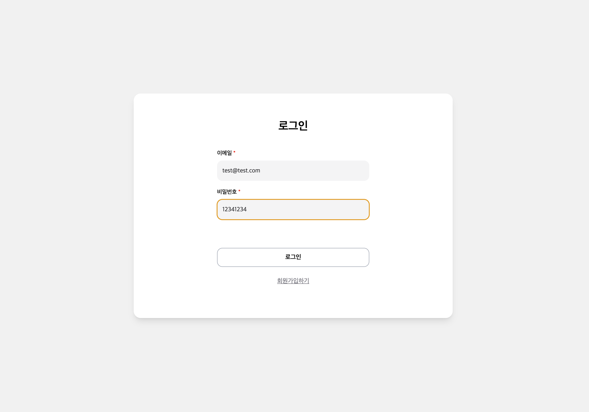
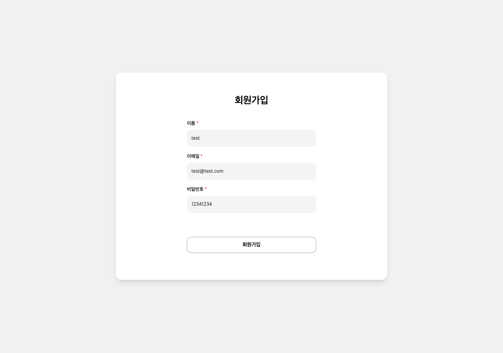
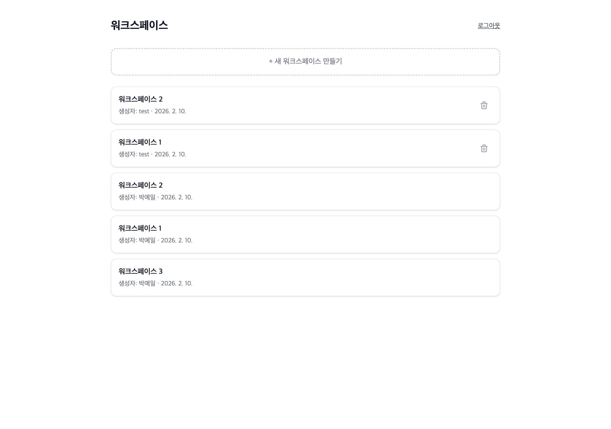
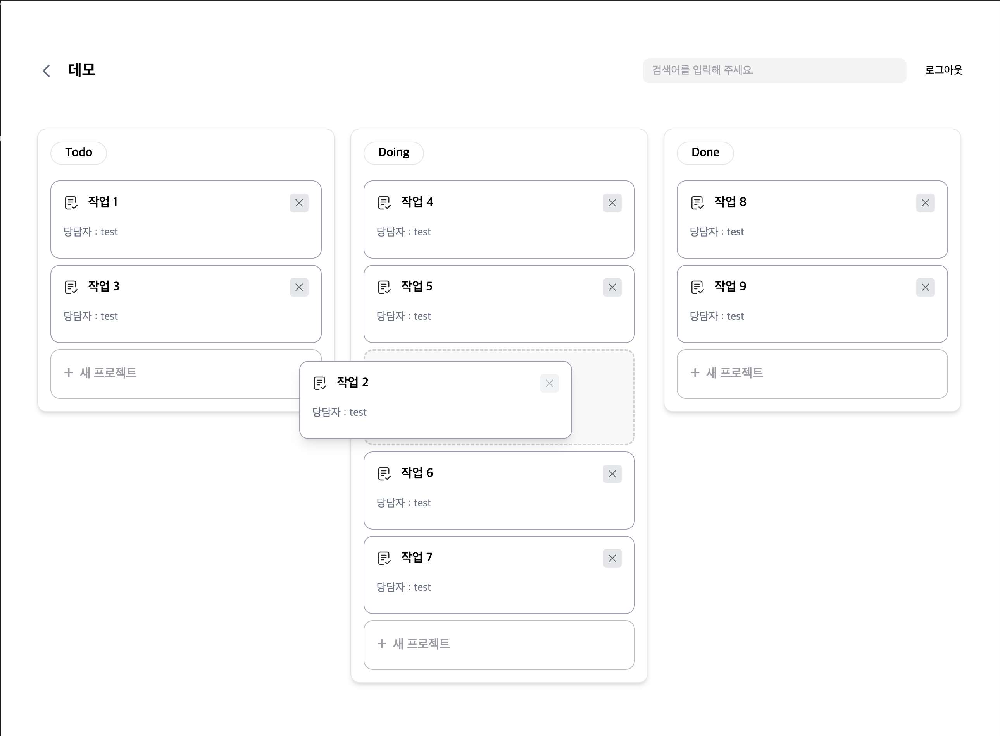
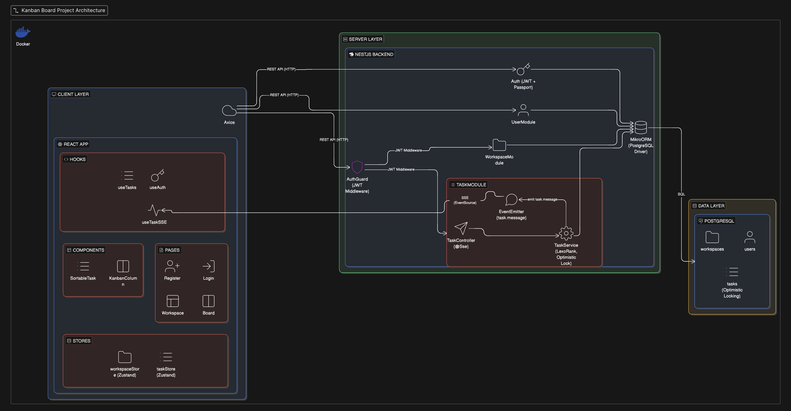
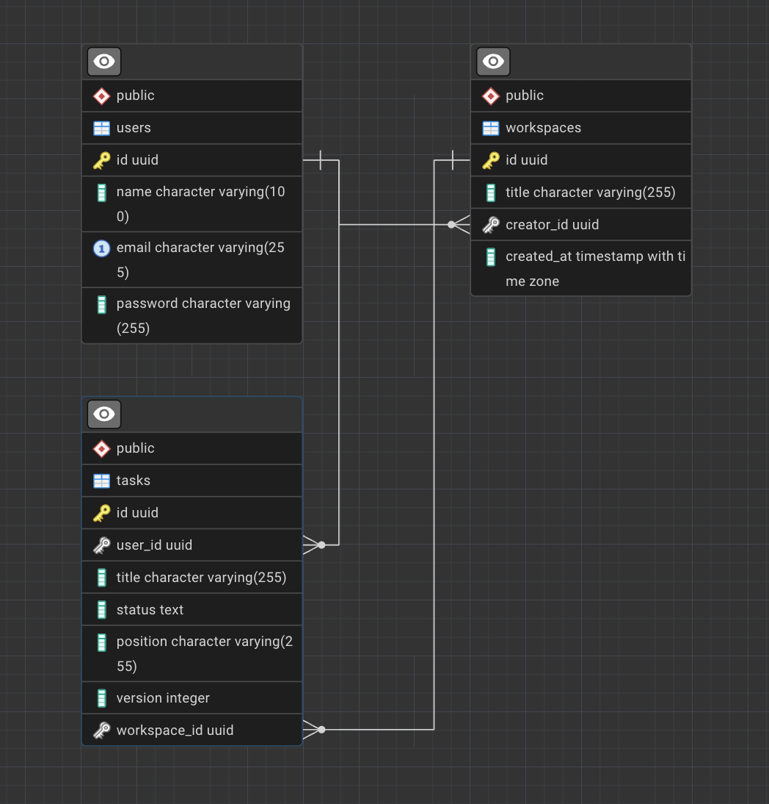

# 실시간 협업 칸반 보드

> 다중 사용자 환경에서 실시간 동기화를 지원하는 칸반 보드 웹 애플리케이션


## 📋 목차

- [프로젝트 소개](#프로젝트-소개)
- [기술 스택](#기술-스택)
- [주요 기능](#주요-기능)
- [시스템 아키텍처](#시스템-아키텍처)
- [데이터 모델 설계](#데이터-모델-설계)
- [핵심 기술 구현](#핵심-기술-구현)
- [프로젝트 구조](#프로젝트-구조)
- [실행 방법](#실행-방법)
- [API 문서](#api-문서)

---

## 프로젝트 소개

여러 사용자가 동시에 작업할 수 있는 실시간 협업 칸반 보드입니다. 드래그 앤 드롭으로 태스크 상태를 변경하면 다른 사용자 화면에도 즉시 반영되며, 동시 수정으로 인한 데이터 충돌을 방지하는 동시성 제어 기능을 구현했습니다.

---

## 기술 스택

### Frontend
| 기술 | 사용 목적 |
|------|----------|
| React | UI 라이브러리 |
| TypeScript | 타입 안정성 |
| Vite | 빌드 도구 (SWC 컴파일러) |
| TanStack Query | 서버 상태 관리 |
| Zustand | 클라이언트 상태 관리 |
| Tailwind CSS | 스타일링 |
| dnd-kit | 드래그 앤 드롭 |
| Axios | HTTP 클라이언트 |

### Backend
| 기술 | 사용 목적 |
|------|----------|
| NestJS | 백엔드 프레임워크 |
| TypeScript | 타입 안정성 |
| MikroORM | ORM (Optimistic Lock 지원) |
| PostgreSQL | 데이터베이스 |
| Passport | 인증 미들웨어 |
| Swagger | API 문서화 |

### DevOps
| 기술 | 사용 목적 |
|------|----------|
| Docker | 컨테이너화 |
| Docker Compose | 멀티 컨테이너 오케스트레이션 |

---

### 데모

| 로그인 | 회원가입 |
|--------|----------|
|  |  |

| 워크스페이스 | 칸반 보드 |
|-------------|----------|
|  |  |

---

## 주요 기능

###  사용자 인증
- JWT 기반 회원가입 / 로그인 / 로그아웃
- Passport.js를 활용한 인증 미들웨어
- bcrypt를 이용한 비밀번호 해싱

### 워크스페이스 관리
- 워크스페이스 생성, 수정, 삭제 (CRUD)
- 테스크는 워크스페이스 단위로 관리됩니다.

###  태스크 관리
- 태스크 생성, 수정, 삭제 (CRUD)
- TODO → DOING → DONE 상태 관리
- 제목 및 생성자 기준 실시간 검색 (디바운스 적용)

###  실시간 동기화
- **SSE (Server-Sent Events)** 기반 실시간 업데이트
- 다른 사용자의 변경사항 즉시 반영
- NestJS Event Emitter를 활용한 이벤트 기반 아키텍처

###  드래그 앤 드롭
- dnd-kit 라이브러리 활용
- 컬럼 간 이동 및 컬럼 내 순서 변경
- Optimistic UI 적용으로 즉각적인 피드백

###  동시성 제어
- **Optimistic Locking** (버전 기반 낙관적 잠금)
- **LexoRank** 알고리즘을 활용한 정렬 충돌 최소화

---


## 시스템 아키텍처



### 설계 결정 사항

#### 프론트엔드 ↔ 백엔드 통신
| 구분 | 기술 | 선택 이유 |
|------|------|----------|
| API 통신 | REST API + Axios | 리소스 기반 CRUD에 적합, 간단한 구현 |
| 실시간 동기화 | SSE (Server-Sent Events) | WebSocket 대비 구현 복잡도 낮음, 서버→클라이언트 단방향 통신으로 충분 |

#### 상태 관리 전략
| 상태 유형 | 기술 | 관리 대상 |
|----------|------|----------|
| 서버 상태 | TanStack Query | API 응답 캐싱, 자동 리페칭, 뮤테이션 |
| 클라이언트 상태 | Zustand | 검색어, Optimistic UI용 로컬 상태 |

#### 백엔드 아키텍처
- **모듈 기반 설계**: NestJS의 모듈 시스템으로 기능별 분리 (auth, user, workspace, task)
- **이벤트 기반 통신**: EventEmitter를 활용한 모듈 간 느슨한 결합
- **계층 분리**: Controller → Service → Repository 패턴 적용

#### 데이터베이스
- **PostgreSQL 선택 이유**: 트랜잭션 지원, Optimistic Lock 지원
- **ORM**: MikroORM 사용 PostgreSQL에 다양한 기능지원.

#### 컨테이너화
- **Docker Compose**: Frontend, Backend, PostgreSQL을 단일 명령으로 실행
- **환경 분리**: 개발/운영 환경별 설정 분리 가능

---

## 데이터 모델 설계



### 설계 결정 사항

#### Workspace – Task 관계 (식별 관계)
- Task는 반드시 하나의 Workspace에 속해야 함
- Workspace 삭제 시 하위 Task도 함께 삭제 (Cascade Delete)
- `orphanRemoval: true` 적용으로 고아 객체 자동 제거

#### User – Task 관계 (비식별 관계)
- User가 삭제되어도 Task는 유지되어야 하는 비즈니스 요구사항
- `deleteRule: 'set null'` 적용으로 User 삭제 시 Task의 user_id만 NULL 처리
- Task는 User의 생명주기에 종속되지 않음

#### User – Workspace 관계
- Workspace는 생성자(creator)를 가짐
- 생성자만 Workspace 수정/삭제 가능 (권한 제어)

#### 동시성 제어
- `version` 필드를 통한 Optimistic Locking
- 동시 수정 시 버전 불일치로 충돌 감지 → 사용자에게 재시도 안내
- LexoRank를 통한 position 값 관리로 정렬 충돌 최소화

---

## 핵심 기술 구현

### 1. 실시간 동기화 (SSE)

**왜 SSE를 선택했는가?**
- WebSocket 대비 구현 복잡도 낮음
- 서버 → 클라이언트 단방향 통신으로 충분
- HTTP/2 환경에서 효율적인 멀티플렉싱

**구현 방식**
```typescript
// Backend: Event Emitter를 통한 느슨한 결합
@Sse('events')
sse(): Observable<MessageEvent> {
  return fromEvent(this.eventEmitter, 'task.message').pipe(
    map((payload) => ({ data: payload }) as MessageEvent)
  );
}

// Task 변경 시 이벤트 발행
private emitChange(type: string, data: any) {
  this.eventEmitter.emit('task.message', { type, data });
}
```

```typescript
// Frontend: SSE 연결 및 상태 동기화
const handleEvent = (event: TaskSSEEvent) => {
  switch (event.type) {
    case 'create': addTask(event.data); break;
    case 'update':
    case 'move': updateTaskInList(event.data); break;
    case 'delete': removeTask(event.data.id); break;
  }
};
```

### 2. 동시성 제어 (Optimistic Locking + LexoRank)

**문제 상황**
- 여러 사용자가 동시에 같은 태스크를 수정할 때 데이터 일관성 문제
- 드래그 앤 드롭 시 순서 변경에 따른 position 값 충돌

**해결 방안**
```typescript
// MikroORM의 @Property({ version: true })를 활용한 자동 버전 관리
@Property({ version: true })
version!: number;

// 버전 불일치 시 예외 발생
try {
  await this.em.flush();
} catch (e) {
  if (e instanceof OptimisticLockError) {
    throw new ConflictException(
      '이미 다른 사용자에 의해 수정된 태스크입니다. 새로고침 후 다시 시도해주세요.'
    );
  }
}
```

**LexoRank 알고리즘**
```typescript
// 두 태스크 사이에 삽입 시 중간값 계산
if (prevRank && nextRank) {
  newPosition = prevRank.between(nextRank).toString();
} else if (prevRank) {
  newPosition = prevRank.genNext().toString();
} else if (nextRank) {
  newPosition = nextRank.genPrev().toString();
}
```
→ 기존 태스크의 position을 수정하지 않아 충돌 가능성 최소화

### 3. 상태 관리 전략

**서버 상태 (TanStack Query)**
- 태스크 목록 캐싱 및 자동 리페칭
- Mutation 성공/실패 시 캐시 무효화

**클라이언트 상태 (Zustand)**
- 드래그 중인 태스크 ID
- 검색어 상태
- Optimistic UI를 위한 로컬 상태

```typescript
// Optimistic Update 예시
const oldTask = updateTaskTitle(id, title); // 즉시 UI 반영
try {
  await mutateAsync({ id, title });
} catch {
  // 실패 시 롤백
  if (oldTask) updateTaskTitle(id, oldTask.title);
}
```

### 4. N+1 문제 해결 (Eager Loading)

**문제 상황**
- Task 목록 조회 시 각 Task의 User 정보를 개별 쿼리로 가져오면 N+1 문제 발생
- Task 10개 조회 시 → 1(Task 목록) + 10(각 User 조회) = 11번의 쿼리 실행

**해결 방안: MikroORM의 `populate` 옵션으로 Eager Loading**
```typescript
// task.service.ts - findAll
const tasks = await this.taskRepository.find(query, {
  populate: ['user'],  // User를 함께 로드하여 N+1 방지
  fields: ['id', 'title', 'status', 'user.name', 'position', 'version'],
  orderBy: { position: 'ASC' },
});

// workspace.service.ts - findAll
const workspaces = await this.workspaceRepository.find({}, {
  populate: ['creator'],  // Creator를 함께 로드하여 N+1 방지
  orderBy: { createdAt: 'DESC' },
});
```

→ 연관 엔티티를 한 번의 쿼리로 함께 로드하여 쿼리 수를 최소화

---

## 프로젝트 구조

```
project-kanban/
├── backend/
│   ├── src/
│   │   ├── modules/
│   │   │   ├── auth/          # 인증 모듈 (JWT, Passport)
│   │   │   ├── user/          # 사용자 모듈
│   │   │   ├── workspace/     # 워크스페이스 모듈 (CRUD)
│   │   │   ├── task/          # 태스크 모듈 (CRUD, SSE)
│   │   │   └── health/        # 헬스체크
│   │   ├── main.ts
│   │   └── mikro-orm.config.ts
│   ├── Dockerfile
│   └── package.json
│
├── frontend/
│   ├── src/
│   │   ├── api/               # API 클라이언트
│   │   ├── components/        # UI 컴포넌트
│   │   ├── hooks/             # Custom Hooks
│   │   ├── pages/             # 페이지 컴포넌트
│   │   ├── stores/            # Zustand 스토어
│   │   └── types/             # TypeScript 타입
│   ├── Dockerfile
│   └── package.json
│
├── docker-compose.yml
└── README.md
```

---


## 실행 방법

### 사전 요구사항
- Docker & Docker Compose

### Docker Compose로 실행 (권장)

```bash
# 1. 프로젝트 클론
git clone https://github.com/your-repo/project-kanban.git
cd project-kanban

# 2. 환경 변수 설정 (선택사항 - 기본값 제공)
# backend/.env.example과 frontend/.env.example 참고

# 3. 전체 서비스 실행
docker compose up -d
```
기본 접속 정보
 - Frontend: http://localhost:5173
 - Backend API: http://localhost:3000
 - API 문서: http://localhost:3000/docs


## API 문서

서버 실행 후 Swagger UI에서 확인 가능합니다.

📄 **API 문서 URL**: http://localhost:3000/docs

### 주요 엔드포인트

#### 인증
| Method | Endpoint | 설명 | 인증 |
|--------|----------|------|------|
| POST | /auth/register | 회원가입 | - |
| POST | /auth/login | 로그인 (JWT 발급) | - |

#### 워크스페이스
| Method | Endpoint | 설명 | 인증 |
|--------|----------|------|------|
| GET | /workspaces | 워크스페이스 목록 조회 | 필요 |
| GET | /workspaces/:id | 워크스페이스 상세 조회 | 필요 |
| POST | /workspaces | 워크스페이스 생성 | 필요 |
| PATCH | /workspaces/:id | 워크스페이스 수정 (생성자만) | 필요 |
| DELETE | /workspaces/:id | 워크스페이스 삭제 (생성자만) | 필요 |

#### 태스크
| Method | Endpoint | 설명 | 인증 |
|--------|----------|------|------|
| GET | /workspaces/:workspaceId/tasks | 태스크 목록 조회 (검색 지원) | 필요 |
| POST | /workspaces/:workspaceId/tasks | 태스크 생성 | 필요 |
| PATCH | /workspaces/:workspaceId/tasks/:id | 태스크 수정 | 필요 |
| PATCH | /workspaces/:workspaceId/tasks/:id/move | 태스크 이동 (상태/순서 변경) | 필요 |
| DELETE | /workspaces/:workspaceId/tasks/:id | 태스크 삭제 | 필요 |
| GET | /workspaces/:workspaceId/tasks/events | SSE 이벤트 스트림 | 필요 |

---


